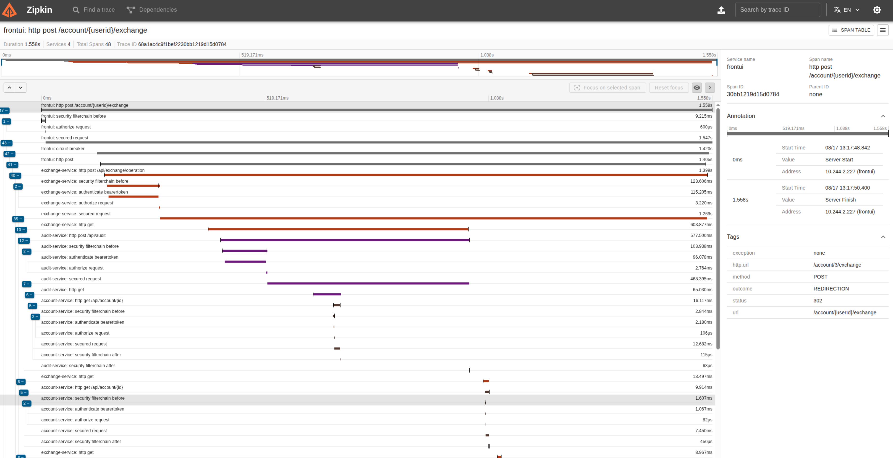
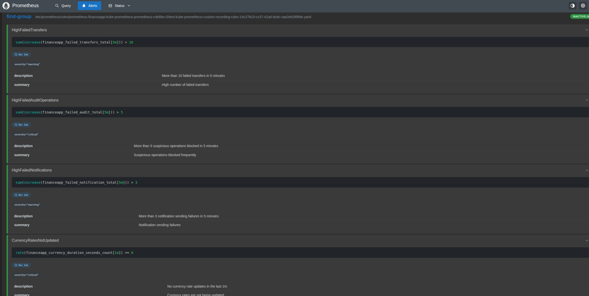
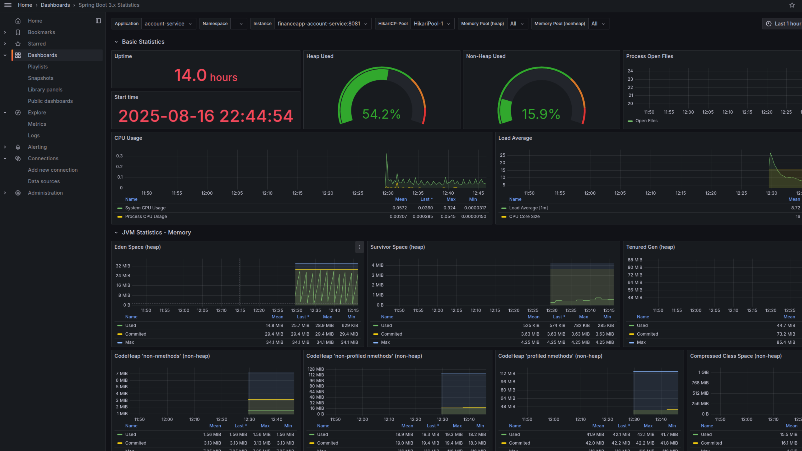
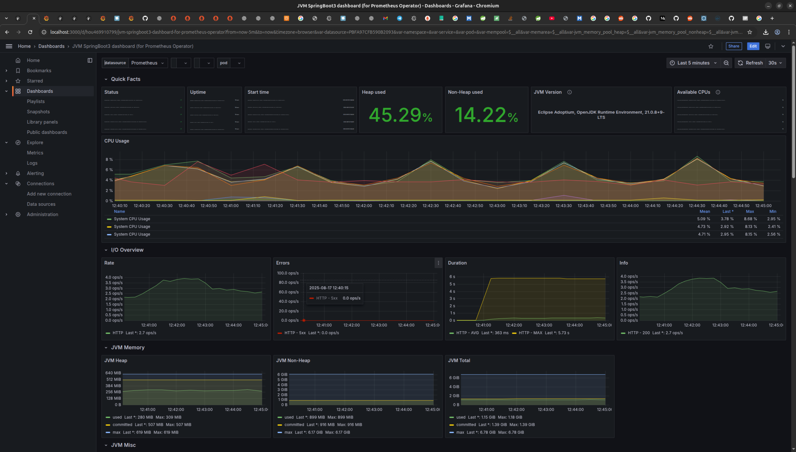
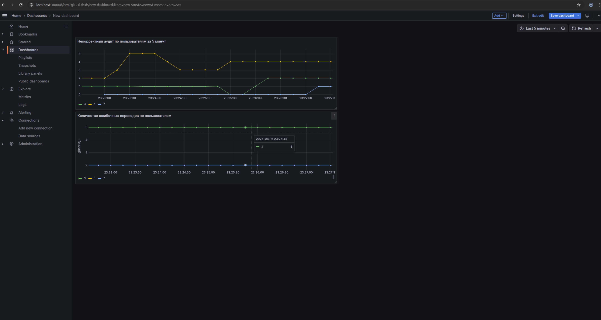
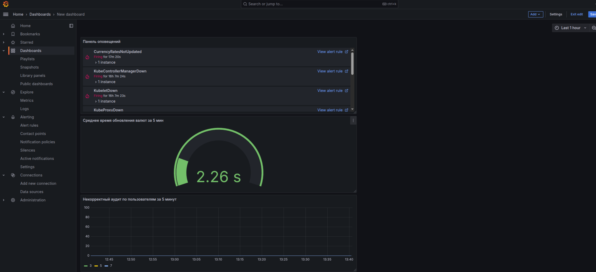

# Spring Boot приложение онлайн банка

# Installation & Run 🚀

## Minikube way

1. Удалите данные установки для Jenkins (Docker desktop)

2. Установите Minikube
[Minikube Installation Guide](https://kubernetes.io/ru/docs/tasks/tools/install-minikube/)

3. Установите Helm
[Helm Installation Guide](https://helm.sh/docs/intro/install/)

4. Соберите проект
`./gradlew clean build`

5. Запустите minikube

`minikube start --memory=8192 --driver=docker`

`minikube addons enable ingress`

6. **Настройка dns и hosts:**

`kubectl -n kube-system get configmap coredns -o yaml > corednstest.yaml`

Добавить в corednstest после health секции:

rewrite name keycloak.local financeapp-keycloak.test.svc.cluster.local

`kubectl apply -f corednstest.yaml`

`kubectl -n kubesystem rollout restart deployment coredns`

`kubectl patch svc ingress-nginx-controller -n ingress-nginx -p '{"spec": {"type": "LoadBalancer"}}'`

**Linux:**

`sudo nano /etc/hosts`
добавить

**127.0.0.1 finance.local**

**127.0.0.1 keycloak.local**

**Windows:**

c:\windows\system32\drivers\etc\hosts
добавить

**127.0.0.1 finance.local**

**127.0.0.1 keycloak.local**

Настройка для разных ОС заканчивается здесь.

7. Запуск тунеля
`minikube tunel`

8. Сборка Docker-образов и импорт в Minikube:

Воспользоваться redeploy.sh или в ручную

`helm uninstall financeapp -n test`

_Строим образы:_

`docker build -t account-service:0.1.0 ./account-service`

`docker build -t audit-service:0.1.0 ./audit-service`

`docker build -t cash-service:0.1.0 ./cash-service`

`docker build -t dictionaries-service:0.1.0 ./dictionaries-service`

`docker build -t exchange-service:0.1.0 ./exchange-service`

`docker build -t front-ui:0.1.0 ./front-ui`

`docker build -t notification-service:0.1.0 ./notification-service`

`docker build -t transfer-service:0.1.0 ./transfer-service`

_Импортируем образы:_

`minikube image load account-service:0.1.0`

`minikube image load audit-service:0.1.0`

`minikube image load cash-service:0.1.0`

`minikube image load dictionaries-service:0.1.0`

`minikube image load exchange-service:0.1.0`

`minikube image load front-ui:0.1.0`

`minikube image load notification-service:0.1.0`

`minikube image load transfer-service:0.1.0`

9. Обновляем репозитории:

`helm repo add stable https://charts.helm.sh/stable`

`helm repo add bitnami https://raw.githubusercontent.com/bitnami/charts/refs/heads/archive-full-index/bitnami`

`helm repo update`

10. Установка релиза:
`helm upgrade --install financeapp ./financeapp -f ./financeapp/values.yaml --namespace test --create-namespace`

## Docker Desktop Jenkins way

1. Удалите данные установки для Minikube

Установите Docker Desktop
https://docs.docker.com/desktop/setup/install/windows-install/

2. В настройках включить встроенный кластер, выделить достаточные ресурсы

3. Установите Helm
https://helm.sh/docs/intro/install/

4. Установите Ingress

`helm repo add ingress-nginx https://kubernetes.github.io/ingress-nginx`

`helm repo update`

`helm install my-nginx-ingress ingress-nginx/ingress-nginx`

`./gradlew clean build`

**Linux:**
`sudo nano /etc/hosts`
добавить

**127.0.0.1 finance.local**
**127.0.0.1 keycloak.local**

**Windows:**
c:\windows\system32\drivers\etc\hosts
добавить
**127.0.0.1 finance.local**
**127.0.0.1 keycloak.local**

`docker compose up --build`

дальше работать с Jenkins

http://localhost:8080/

# Мониторинг и логи

После установки приложения

## Zipkin

`kubectl port-forward svc/financeapp-zipkin 9411:9411 -n test`

зайти на http://localhost:9411/zipkin/

## Prometheus

`kubectl port-forward svc/financeapp-kube-prometheus-prometheus   9090:9090 -n test`

зайти на http://localhost:9090/

## Grafana

`kubectl port-forward  svc/financeapp-grafana 3000:80 -n test`

зайти на http://localhost:3000/dashboards нажать кнопку "New" - "Import" перекинуть файлы из папки dashboard
[custom.json](dashboard/custom.json)

[http.json](dashboard/http.json)

[jvm.json](dashboard/jvm.json)

[springboot.json](dashboard/springboot.json)

Открываем необходимый dashboard

Стандартный с метриками по микросервисам

JVM

Custom включает 2 линейных виджета, шкала, панель alerts

# 🗄 Database
[account](account-service/src/main/resources/db/changelog/init-data-account.xml)

[audit](audit-service/src/main/resources/db/changelog/init-storedata-rule.xml)

[cash](cash-service/src/main/resources/db/changelog/init-storedata-cash.xml)

[exchange](exchange-service/src/main/resources/db/changelog/init-storedata-exchange.xml)

[notification](notification-service/src/main/resources/db/changelog/init-storedata-notification.xml)

[transfer](transfer-service/src/main/resources/db/changelog/init-storedata-transfer.xml)

# ✅ Run tests
_**Module**_

./gradlew test

_**Integration**_

./gradlew verify

# ⚙ Build
./gradlew build

# 🛠 Использованные технологии:
* Build: Gradle.
* Java: 21.
* UI: thymeleaf + Spring MVC + bootstrap
* DB: Spring Data JPA + Hibernate ORM
* PostgreSQL: Database per Service.
* Service Discovery: K8s
* Externalized/Distributed Config: K8s
* K8s dns, Ingress
* Security: Keycloak Access Token (JWT) по client credentials для выполнения запросов в другие микросервисы.
* API: Resilence4j + Open Feign + Kafka
* Test: JUnit 5, TestContext Framework, Spring Boot Test, Spring Cloud Contract.
* Container: K8s
* Deploy: Minikube, Jenkins
* Tracing - Zipkin
* Monitoring - Prometheus + Grafana

# 📦 Микросервисы
* front-ui микросервис с графическим интерфейсом реализован на thymeleaf в дальнейшем желательно переписать полностью на  
  JS, используется интеграция c keycloak для создания и аутентификации пользователей.
* account-service микросервис счетов реализован паттерн Transactional Outbox
* cash-service микросервис проведения операции с наличными средствами
* transfer-service микросервис переводов
* exchange-service микросервис обмена валют
* dictionaries-service микросервис справочной информации
* audit-service микросервис проверки операций на соответствие правилам
* notification-service сервис уведомлений
* chassis-api сервис с общими классами
* chassis-service-client сервис с общими настройками Openfeign 